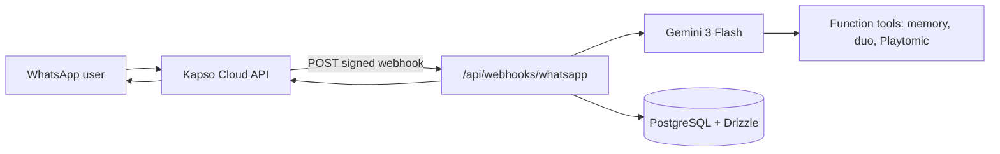

# LobSmash Coach

**Your padel coach lives in WhatsApp.** Built for the [Vercel × Google DeepMind hackathon](https://vercel.com) — real-time coaching, memory, and duo play — without leaving the chat app you already use.


## Why this exists

Padel is fast, technical, and social. Generic AI chat feels cold; a coach in **WhatsApp** meets players where they plan matches, share clips, and trash-talk friends. LobSmash Coach uses **Gemini** for multimodal reasoning (text + images/video) and **structured coaching** so every reply is actionable — not a wall of text.

## What you get

- **WhatsApp-native coach** — Inbound messages via [Kapso](https://kapso.ai) webhooks; signed, production-style delivery to Next.js.
- **Consistent playbook** — Every answer uses four sections: *What went wrong* → *What to fix* → *Drill* → *Goal for next time* (easy to scan on a phone).
- **Multimodal feedback** — Send a photo or clip of your swing; the coach comments on what it sees.
- **Solo & duo modes** — Practice alone or pair with a partner; “before the match” / “after the match” steers **duo pre** vs **duo post** debriefs.
- **Partner pairing** — Message with “partner” + a phone number to start pairing; the other player confirms with `PAIR <CODE>` (see `SANDBOX.md`).
- **Playtomic-aware** — Tools surface booking links; the bot never invents live court availability (honest logistics).

## Architecture



- **Framework:** [Next.js 15](https://nextjs.org) (App Router) — deploy on Vercel in one click.
- **Model:** `gemini-3-flash-preview` via `@google/genai` (Interactions-style multimodal input).
- **Data:** PostgreSQL (Supabase pooler) + Drizzle ORM — sessions, memory, duo pairing.
- **Messaging:** `@kapso/whatsapp-cloud-api` for sends and media download.

## Quick start

1. Clone and install:

   ```bash
   git clone https://github.com/trenchsheikh/lobsmash-whatsapp.git
   cd lobsmash-whatsapp
   npm install
   ```

2. Copy env and fill secrets:

   ```bash
   cp .env.example .env
   ```

   Set `GEMINI_API_KEY`, Kapso keys, `KAPSO_WEBHOOK_SECRET`, `WHATSAPP_PHONE_NUMBER_ID`, and **`DATABASE_URL`** (Supabase **Session pooler** URI from the dashboard). See **`SANDBOX.md`** for webhook URL, pairing flow, and end-to-end checks.

3. Prepare the database (apply schema to Supabase):

   ```bash
   npm run db:push
   ```

   Or apply SQL migrations: `npm run db:migrate` (after `npm run db:generate` when the schema changes).

4. Run locally:

   ```bash
   npm run dev
   curl http://localhost:3000/api/health
   ```

5. Point Kapso’s phone-number webhook at `https://<your-host>/api/webhooks/whatsapp` (ngrok, Cloudflare Tunnel, or Vercel preview).

## Deploy on Vercel

- Import the repo, set the same environment variables in the Vercel project settings (including **`DATABASE_URL`**).
- Run `npm run db:push` once against production or ship migrations from CI so tables exist before traffic hits the webhook.

## Project layout

| Path | Role |
|------|------|
| `app/api/webhooks/whatsapp/route.ts` | Kapso webhook handler |
| `lib/coach/run-lob-smash.ts` | Gemini coach loop + tools |
| `lib/lobsmash-system-prompt.ts` | Modes: solo, duo pre/post |
| `lib/partner-flow.ts` | Partner pairing |
| `lib/db/` | Schema & queries |

## License & hackathon

Built as a hackathon demo — iterate freely. If LobSmash helps your game, share the repo and your best bandeja clip.

---

*Not affiliated with Playtomic, WhatsApp, or Meta. Padel: stay low, finish the volley.*
