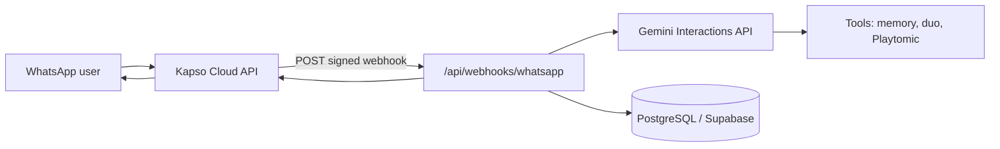

# LobSmash Coach

**Your padel coach lives in WhatsApp.** Built for the [Vercel × Google DeepMind “Zero to Agent”](https://community.vercel.com/) hackathon series — coaching, memory, and duo play in the chat app you already use.


## Why this exists

Padel is fast, technical, and social. Generic AI chat feels cold; a coach in **WhatsApp** meets players where they plan matches, share clips, and talk strategy. LobSmash Coach uses **Gemini** for multimodal reasoning (text + images/video) and **structured coaching** so every reply is actionable — not a wall of text.

## What you get

- **WhatsApp-native coach** — Inbound messages via [Kapso](https://kapso.ai) webhooks; signed delivery to Next.js (`X-Webhook-Signature`).
- **Consistent playbook** — Every answer uses four sections: *What went wrong* → *What to fix* → *Drill* → *Goal for next time* (easy to scan on a phone).
- **Multimodal feedback** — Send a photo or clip of your swing; the coach comments on what it sees.
- **Solo & duo modes** — Practice alone or pair with a partner; “before the match” / “after the match” steers **duo pre** vs **duo post** debriefs.
- **Partner pairing** — Message with “partner” + a phone number to start pairing; the other player confirms with `PAIR <CODE>` (see **`SANDBOX.md`**).
- **Playtomic-aware** — Tools surface booking links; the bot never invents live court availability (honest logistics).

## Architecture



| Layer | Choice |
|--------|--------|
| **App** | [Next.js 15.2](https://nextjs.org) (App Router), React 19, Turbopack dev (`npm run dev`) |
| **Model** | `gemini-3-flash-preview` via `@google/genai` — **falls back** to `gemini-2.5-flash` if the primary model errors. Interactions API with `store: true` and multimodal input. |
| **Data** | [PostgreSQL](https://www.postgresql.org/) through Supabase **session pooler** + [Drizzle ORM](https://orm.drizzle.team/) + [`pg`](https://node-postgres.com/). Pool size is capped lower on Vercel (`DATABASE_POOL_MAX` optional). |
| **Messaging** | `@kapso/whatsapp-cloud-api` for outbound sends and media download. |

## Quick start

1. Clone and install:

   ```bash
   git clone https://github.com/trenchsheikh/lobsmash-whatsapp.git
   cd lobsmash-whatsapp
   npm install
   ```

2. Environment — copy and fill:

   ```bash
   cp .env.example .env
   ```

   Set `GEMINI_API_KEY`, Kapso (`KAPSO_API_KEY`, `KAPSO_WEBHOOK_SECRET`, `WHATSAPP_PHONE_NUMBER_ID`), and **`DATABASE_URL`** (Supabase **Session pooler** URI from the dashboard — same variable on Vercel). Optional: `DATABASE_POOL_MAX` (defaults: 2 on Vercel, 10 locally).

3. Database:

   ```bash
   npm run db:push
   ```

   After schema changes: `npm run db:generate` then `npm run db:migrate`, or keep using `db:push` for rapid iteration.

4. Run the app:

   ```bash
   npm run dev
   curl http://localhost:3000/api/health
   ```

5. **Webhooks need a public HTTPS URL** — Kapso cannot call `localhost`. Use **ngrok**, **Cloudflare Tunnel**, or a **Vercel preview** URL and register  
   `https://<your-host>/api/webhooks/whatsapp`  
   in Kapso. Details: **`SANDBOX.md`**.

## Deploy on Vercel

- Import the repo and set the same environment variables (including **`DATABASE_URL`**).
- Run `npm run db:push` (or ship migrations) against production **before** traffic hits the webhook so tables exist.
- If you see stuck replies after a bad deploy, see **Troubleshooting** in **`SANDBOX.md`** (`processed_messages` / duplicate delivery).

## Project layout

| Path | Role |
|------|------|
| `app/api/webhooks/whatsapp/route.ts` | Kapso webhook handler |
| `lib/coach/run-lob-smash.ts` | Gemini Interactions loop, tool calls, model fallback |
| `lib/lobsmash-system-prompt.ts` | Modes: solo, duo pre/post |
| `lib/partner-flow.ts` | Partner pairing |
| `lib/db/` | Drizzle schema & queries |

## License & hackathon

Built as a hackathon demo — iterate freely. If LobSmash helps your game, share the repo and your best bandeja clip.

---

*Not affiliated with Playtomic, WhatsApp, or Meta. Padel: stay low, finish the volley.*
